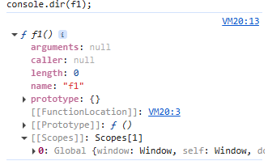

# Tu_hoc_back_end
Repo này ghi lại quá trình tự học back-end theo roadmap trong link: https://roadmap.sh/backend

## Tác giả: Ngô Bá Tài
## Chương 1: Internet 
### 1.1 Internet hoạt động như nào
#### 1.1.1 Internet là gì?
[Internet là gì ?](https://youtu.be/Dxcc6ycZ73M)

[Hệ thống Internet:Dây dẫn, cáp mạng và Wi-Fi](https://youtu.be/ZhEf7e4kopM)

[Địa chỉ IP, DNS](https://youtu.be/5o8CwafCxnU)

Internet là một mạng lưới thông tin toàn cầu bao gồm những máy tính được kết nối và giao tiếp với nhau thông qua một bộ các giao thức có sẵn

Internet:
* Internet được tạo thành từ một lượng lớn các mạng hoạt động độc lập được liên kết với nhau
* Internet là một hệ thống vật lý được tạo ra để di chuyển thông tin
* Internet cung cấp thông tin dưới dạng các **bits** (Bất kể là hình ảnh, âm thanh, mọi thứ trên Internet đều được biểu diễn và gửi đi dưới dạng các bit - Nguyên tử của những thông tin)

Băng thông (Bandwwidth): Công suất truyền tải tối đa của một thiết bị, băng thông được đo bằng bit rate(Số lượng bit có thể gửi được trong thời gian nhất định được đo bằng giây)

Độ trễ (Latency): Khoảng thời gian cần thiết để dữ liệu di chuyển từ nơi này đến nơi khác

Các loại cáp dùng để gửi thông điệp và tín hiệu:
* Dây Internet: Có thể gửi thông điệp ở khoảng cách ngắn. Không tốn kém chi phí nhưng lại dễ bị mất tín hiệu
* Cáp quang (sử dụng ánh sáng để truyền tin): Có thể gửi thông điệp rất nhanh và xa, không bị mất tín hiệu. Nhưng đổi lại thì rất tốn kém và khó sử dụng
* Tín hiệu vô tuyến: Dùng sóng radio để gửi các bíts (Dịch các bits sang sóng radio với tần số tương ứng, các máy nhận đảo ngược lại quá trình này), cách này chỉ có thể dùng trên di động và không thể đi xa được

**Địa chỉ IP và DNS:**

Giao thức (Protocol): Một bộ các quy tắc và tiêu chuẩn nổi tiếng mà nếu tất cả các bên đồng ý sử dụng nó sẽ cho phép họ giao tiếp mà không gặp rắc rối

Tất cả các thiết bị khác nhau trên Internet đều có 1 địa chỉ duy nhất. Một địa chỉ Internet là một dãy số, tương tự như số điện thoại hoặc 1 loại địa chỉ đường phố. Địa chỉ này là khác biệt với mỗi máy tính hoặc thiết bị sử dụng mạng

Hệ thống địa chỉ trên Internet (Tương tự với địa chỉ đường phố) là một phần của giao thức quan trọng nhất được sử dụng trong giao tiếp Internet và được gọi là giao thức Internet(IP - Internet Protocol). Một địa chỉ máy tính được gọi là địa chỉ IP

Hệ thống tên miền (DNS - Domain Name System): Liên kết các tên miền với các địa chỉ tương ứng. Máy tính sử dụng DNS để tra cứu tên miền và nhận địa chỉ IP tương ứng được sử dụng để kết nối máy tính với địa chỉ đích

**Gói tin, định tuyến và độ ổn định**

### 1.2 Ngôn ngữ lập trình
Trong chương này sẽ hướng tới việc học 2 ngôn ngữ lập trình là JavaScript và Go

[JavaScript](https://roadmap.sh/javascript)

[Go](https://roadmap.sh/golang)

Note: Phần ghi chú các thuật ngữ chung của 2 ngôn ngữ
* Phụ thuộc (Dependencies) là các thư viện / module/ package bên ngoài mà một đoạn mã hoặc dự án cần để hoạt động
* Biến là 1 kho chứa cho giá trị,
* Các đối tượng và hàm đều là biến
#### 1.2.1 JavaScript
Note:
* Nên kết thúc các dòng lệnh bằng dấu ```;```
* Luôn luôn sử dụng từ khóa ```let``` để khai báo biến
* Khi khai báo một biến thì javascript sẽ tạo chỗ cho nó trong bộ nhớ mặc dù chưa thực thi chương trình, sau đó để 1 placeholder cho biến đó với nội dung là undefined
##### a) Quản lý phụ thuộc trong JavaScript

Được quản lý bởi file package.json sử dụng NPM (Node Package Manager) bằng lệnh ```npm init```

Nếu muốn thêm một thư viện thì sử dụng lệnh ```npm install <ten_thu_vien>```
##### b) Khai báo biến
Khai báo biến bằng cách sử dụng từ khóa ```let``` hoặc ```var``` và ngay sau đó là tên biến

Ví dụ:
```
let myName;
var myAge;
```

**Khởi tạo giá trị**
```
myName = "Chris";
myAge = 37;
```

**Một số điểm khác nhau giữa ```var``` và ```let```:**
* Hoisting chỉ hoạt động với var
* Có thể khai báo biến cùng một biến nhiều lần nếu dùng var
* ```let``` và ```var``` đều có phạm vi giống nhau
* Khai báo bằng let không tạo thuộc tính trên globalThis khi được khai báo ở cấp cao nhất của một script
* Khai báo bằng let không tạo thuộc tính trên globalThis khi được khai báo ở cấp cao nhất của một script.

**Ghi đè biến**
```
myName = "Bob";
myAge = 40;
```

* Một số đặc điểm về const: const là một thùng chứa dữ liệu bất biến trong quá trình thực thi chương trình
##### c) Hoisting
Là quá trình mà trình thông dịch đưa các khai báo hàm, biến, lớp, hoặc import lên đầu scope của chúng trước khi thực thi chương trình
##### d) Quy tắc đặt tên biến
* Têm biến chỉ có thể chứa ký tự chữ số (a-z, A-Z, 0-9), dấu ```$``` và dấu ```_```
* Tên biến không thể bắt đầu bằng số
* Tên biến không thể chứa khoảng trắng
* Không được dùng từ khóa làm tên biến

Gợi ý đặt tên biến:
* Đặt tên biến đại diện cho chức năng của nó, ví dụ: ```username```
* Đừng đặt dài quá
* Dùng camel case (Viết hoa các chữ cái đầu tiên của từng từ trừ chữ đầu tiên) cho tên biến và screaming snake case (Viết hoa toàn bộ chữ cái và thay các khoảng trắng bằng dấu "_") cho hằng số

##### e) Phạm vi (Scope)
Scope quyết định khả năng truy cập của các biến, đối tượng và hàm trong các phần khác nhau của đoạn mã

JavaScript có 3 loại phạm vi:
* Phạm vi toàn cục: Là phạm vi bao bọc toàn bộ một tập tin dự án, một biến được khai báo bên ngoài một hàm sẽ có phạm vi toàn cục, một biến có phạm vi toàn cục có thể được truy cập từ bất kì đâu trong dự án
* Phạm vi khối: là phạm vi được bao bọc trong dấu ```{}```, biến được khai báo trong phạm vi khối không thể được truy cập bởi phần tử bên ngoài. Các biến được khai báo bằng ```var``` không thể có phạm vi khối
  
  Ví dụ:
  ```
  {
  let x = 2;
  }
  ```
* Phạm vi hàm: Là phạm vi nằm trong một hàm, bắt đầu từ đoạn khai báo tên hàm cho tới kết thúc của hàm đó. Tương tự như phạm vi khối, các biến được khai báo trong phạm vi hàm không thể được truy cập từ bên ngoài
  Ví dụ:
  ```
  function myFunction() {
  	var carName = "Volvo";   // Function Scope
  }
  ```

Nếu gán giá trị cho một biến chưa được khai báo, nó sẽ tự động trở thành biến toàn cục
```
let carName;
myFunction();

// code here can use carName

function myFunction() {
  carName = "Volvo";
}
```
##### f) Kiểu dữ liệu
JavaScript là một ngôn ngữ lập trình động (là một loại ngôn ngữ lập trình mà kiểu dữ liệu của biến có thể thay đổi trong quá trình thực thi chương trình) với các kiểu dữ liệu động

**Các kiểu dữ liệu nguyên thủy** : Các kiểu dữ liệu được biểu diễn trực tiếp ở cấp thấp nhất của ngôn ngữ

Lưu ý: Toàn bộ các kiểu dữ liệu nguyên thủy (trừ null) có thể được kiểm tra kiểu dữ liệu bằng toán tử ```typeof```. ```typeof null``` trả về **Objects** nên phải dùng so sánh tuyệt đối ```=== null``` để kiểm tra 

* **String (kiểu chuỗi)**: Đại diện cho chữ và được được mã hóa dưới dạng một chuỗi các giá trị số nguyên không dấu 16 bit, đại diện cho các đơn vị mã UTF-16

Các chuỗi trong JavaScript là bất biến (một khi đã tạo thì không thể thay đổi)

String có thể được tạo ra bằng một chuỗi các ký tự, hoặc như một đối tượng sử dụng hàm khởi tạo ```String()```

Ví dụ:
```
const string3 = `Yet another string primitive`;
const string4 = new String("A String object");
```

Các chuỗi ký tự có thể được định nghĩa bằng cách dùng các dấu như ```""```, ```''``` và ``` `` ```

Các phương thức xử lý chuỗi:
```https://developer.mozilla.org/enUS/docs/Web/JavaScript/Reference/Global_Objects/String```

* **undefined**: kiểu dữ liệu nguyên thủy trong JavaScript. Khi một biến được khai báo nhưng chưa được khởi tạo hoặc được gán giá trị, khi đó nó sẽ được lưu trữ là ```undefined```.

Lưu ý: undefined là 1 placeholder tạm thời cho tới khi một biến được gán giá trị nên KHÔNG bao giờ được dùng ```a = undefined;```

* **Null**: là một loại giá trị đặc biệt, đại diện cho sự "vắng mặt" của bất kỳ dữ liệu của đối tượng nào.

Null không phải là Undefined, khi một dữ liệu được khai báo nhưng không được gán giá trị thì đó là undefined, nhưng khi mộ biến được khai báo và gán null thì đó là null

* **Symbol**: là một kiểu dữ liệu nguyên thủy mới được thêm vào, symbol không có dạng kí tự
  Khai báo biến có kiểu dữ liệu symbol: ```let s = Symbol('foo');```, nếu muốn chia sẻ các Symbol thì sử dụng ```Symbol.for()``` Ví dụ: ```let ssn = Symbol.for('ssn')```. Phương thức Symbol.for() đầu tiên tìm kiếm những symbol với khóa ssn trong **global symbol registry**, nếu tồn tại giá trị thì sẽ trả về còn không thì tạo symbol mới
  
  Symbol tạo ra giá trị khác nhau mỗi lần gọi ```console.log(Symbol() === Symbol()); // false```

  Symbol có thể nhận 1 đối số để mô tả chính nó

  Dùng console.log sẽ gọi phương thức toString() để gọi symbol ra ```console.log(firstName); // Symbol(first name)```

  Vì Symbol là kiểu dữ liệu nguyên thủy nên có dùng hàm ```type of``` để kiểm tra ```console.log(typeof firstName);```

**Công dụng của symbol**
* Sử dụng symbol cho giá trị duy nhất:
  Ví dụ: Các trạng thái của một tác vụ như open, in progress, completed, canceled... Thì có thể sử dụng symbol thay vì String
  ```
  let statuses = {
    OPEN: Symbol('Open'),
    IN_PROGRESS: Symbol('In progress'),
    COMPLETED: Symbol('Completed'),
    HOLD: Symbol('On hold'),
    CANCELED: Symbol('Canceled')
  };
  // complete a task
  task.setStatus(statuses.COMPLETED);
  ```
* Sử dụng symbol như tên thuộc tính:
```
let statuses = {
    OPEN: Symbol('open'),
    IN_PROGRESS: Symbol('in-progress'),
    COMPLETE: Symbol('complete'),
    HOLD: Symbol('hold'),
    CANCELED: Symbol('canceled')
}

let status = Symbol("status");

let task = {
    status: statuses.OPEN,
    desciption: "test"
}

console.log(task)
```

Để lấy các thuộc tính enumerable của một đối tượng, bạn sử dụng phương thức ```Object.keys()```, ví dụ: ```console.log(Object.keys(task)); // ["description"]```

Để lấy thuộc tính của toàn bộ đối tượng, sử dụng ```Object.getOwnPropertyNames()```

Để lấy toàn bộ symbols của đối tượng, bạn sử dụng hàm ```Object.getOwnPropertySymbols()```

**Well-known symbols**(Ký hiệu nổi tiếng): ES6 cung cấp các symbol được định nghĩa sẵn, gọi là well-known symbols (các symbol nổi tiếng). Các well-known symbol đại diện cho những hành vi phổ biến trong JavaScript. Mỗi well-known symbol là một thuộc tính tĩnh (static property) của đối tượng Symbol.

[Xem các Well-known symbols ở đây](https://www.javascripttutorial.net/symbol/)

* **Boolean**:Chỉ có 2 giá trị True hoặc False, thường được dùng trong kiểm thử các điều kiện, như là ```if...else``` và ```while```...
  Các toán tử được xác định là false: undefined, null, 0, -0, NaN, 0n, ""

  Các toán tử được xác định là true: các numbers, BigInts, strings, Symbols, all Objects

  Chuyển một giá trị sang boolean: Sử dụng toán tử ```!!```, hoặc hàm Boolean()
* **number**: kiểu dữ liệu ```number``` trong JavaScript đại diện cho số chấm động (floating - point numbers)
  Hàm khởi tạo ```Number``` cung cấp nhiều phương thức để làm việc với numbers, và các kiểu dữ liệu khác có thể được chuyển đổi thành numbers sử dụng hàm ```Numbers()```
  ```
  let num1 = 255; // integer
  let num2 = 255.0; // floating-point number with no fractional part
  let num3 = 0xff; // hexadecimal notation
  let num4 = 0b11111111; // binary notation
  let num5 = 0.255e3; // exponential notation

  console.log(num1 === num2); // true
  console.log(num1 === num3); // true
  console.log(num1 === num4); // true
  console.log(num1 === num5); // true
  ```
* **BigInt**: được tạo ra bằng cách thêm ```n``` vào đuôi của một chuỗi số nguyên bất kỳ, hoặc sử dụng hàm ```BigInt()``` và truyền đối số là số nguyên hoặc chuỗi
  ```
  const previouslyMaxSafeInteger = 9007199254740991n;

	const alsoHuge = BigInt(9007199254740991);
	// 9007199254740991n
	
	const hugeString = BigInt("9007199254740991");
	// 9007199254740991n
	
	const hugeHex = BigInt("0x1fffffffffffff");
	// 9007199254740991n
	
	const hugeOctal = BigInt("0o377777777777777777");
	// 9007199254740991n
	
	const hugeBin = BigInt(
	  "0b11111111111111111111111111111111111111111111111111111",
	);
	```
Tuy các giá trị ```Bigint``` khá giống với ```Number```, nhưng có một số khác biệt chính giữa 2 kiểu dữ liệu này, ```BigInt``` không thể được sử dụng với các phương thức trong đối tượng ```Math``` và không thể được dùng với ```Number``` trong các phép toán, 

BigInt có thể thực hiện các phép toán học nhưng phải đảm bảo các toán hạng đều cùng 1 kiểu dữ liệu
* Arithmetic operators: +, -, *, /, %, **
* Bitwise operators: >>, <<, &, |, ^, ~
* Unary negation (-)
* Increment/decrement: ++, --

Các phép so sánh trả về boolean cho phép trộn lẫn kiểu numbers và BigInts
* Relational operators and equality operators: >, <, >=, <=, ==, !=, ===, !==
* Logical operators only rely on the truthiness of operands
```
const previousMaxSafe = BigInt(Number.MAX_SAFE_INTEGER); // 9007199254740991n
const maxPlusOne = previousMaxSafe + 1n; // 9007199254740992n
const theFuture = previousMaxSafe + 2n; // 9007199254740993n, this works now!
const prod = previousMaxSafe * 2n; // 18014398509481982n
const diff = prod - 10n; // 18014398509481972n
const mod = prod % 10n; // 2n
const bigN = 2n ** 54n; // 18014398509481984n
bigN * -1n; // -18014398509481984n
const expected = 4n / 2n; // 2n
const truncated = 5n / 2n; // 2n, not 2.5n
```
##### g) Toán tử typeof
```typeOf``` được dùng để tìm kiểu dữ liệu của một biến trong JavaScript. Nó trả về một chuỗi tương ứng với kiểu của giá trị được truyền vào. 

```
console.log(typeof 42);
// Expected output: "number"

console.log(typeof "blubber");
// Expected output: "string"

console.log(typeof true);
// Expected output: "boolean"

console.log(typeof undeclaredVariable);
// Expected output: "undefined"
```
Cú pháp ```typeof operand```, output là kiểu dữ liệu tương ứng với giá trị được truyền vào, riêng ```null``` thì trả về ```Object```(trong các phiên bản đầu tiên của JS, các giá trị được biểu diễn theo cặp tag và value, các đối tượng có tag là 0 và khi đó null được biểu diễn bằng con trỏ NULL có giá trị là ```0x00```, nên trình JS hiểu null là một đối tượng)

**Lưu ý**:
Tất cả các hàm khởi tạo được gọi với từ khóa ```new``` sẽ trả về giá trị không nguyên thủy, ngoại lệ duy nhất là ```Function```.

Ví dụ:
```
const str = new String("String");
const num = new Number(100);

typeof str; // "object"
typeof num; // "object"

const func = new Function();

typeof func; // "function"
```

```typeof``` có độ ưu tiên hành động cao hơn các toán tử nhị phân, do vậy cần phải bọc các 

```
function type(value) {
  if (value === null) {
    return "null";
  }
  const baseType = typeof value;
  // Primitive types
  if (!["object", "function"].includes(baseType)) {
    return baseType;
  }

  // Symbol.toStringTag often specifies the "display name" of the
  // object's class. It's used in Object.prototype.toString().
  const tag = value[Symbol.toStringTag];
  if (typeof tag === "string") {
    return tag;
  }

  // If it's a function whose source code starts with the "class" keyword
  if (
    baseType === "function" &&
    Function.prototype.toString.call(value).startsWith("class")
  ) {
    return "class";
  }

  // The name of the constructor; for example `Array`, `GeneratorFunction`,
  // `Number`, `String`, `Boolean` or `MyCustomClass`
  const className = value.constructor.name;
  if (typeof className === "string" && className !== "") {
    return className;
  }

  // At this point there's no robust way to get the type of value,
  // so we use the base implementation.
  return baseType;
}
```
##### h) Đối tượng (object)
Là cấu trúc dữ liệu cho phép chùng ta có các cặp key-value, để chúng ta có các key độc nhất và mỗi key được liên kết với một giá trị có thể thuộc bất kì kiểu dữ liệu nào trong JS. Ví dụ: một cây bút có nhiều thuộc tính như màu sắc, thiết kế, chất liệu mà nó được làm từ... Tương tự như vậy, các đối tượng JS có thể có các thuộc tính để điều chỉnh hành vi của chúng.

* **Tạo đối tượng mới**
  Có nhiều cách để tạo một đối tượng như sử dụng ```object initializer```, hoặc sử dụng hàm khởi tạo và sau đó tạo một đối tượng bằng cách sử dụng toán tử ```new```

**Sử dụng object initializers**
```
const a = {
    a: 221,
    23: "Hello",
    45: 12313n
}
```

```
const myHonda = {
  color: "red",
  wheels: 4,
  engine: { cylinders: 4, size: 2.2 },
};
```
Mỗi tên thuộc tính trước dấu ```:``` là một định danh (identifier), nó có thể là một biến, chữ số hoặc là một chuỗi. Các giá trị sau dấu ```:``` là các biểu thức được gán vào tên thuộc tính. 

**Sử dụng hàm khởi tạo**
Định nghĩa kiểu đối tượng bằng cách viết một hàm khởi tạo, sau đó tạo thể hiện của đối tượng bằng cách dùng new dùng ```new```

```
function Car(make, model, year) {
  this.make = make;
  this.model = model;
  this.year = year;
}

const myCar = new Car("Eagle", "Talon TSi", 1993);
```
**Sử dụng phương thức Object.create()**
Phương thức này rất hữu dụng, vì nó cho phép bạn chọn mẫu đối tượng cho đối tượng bạn muốn tạo mà khồn cần một hàm khởi tạo
```
// Animal properties and method encapsulation
const Animal = {
  type: "Invertebrates", // Default value of properties
  displayType() {
    // Method which will display type of Animal
    console.log(this.type);
  },
};

// Create new animal type called animal1
const animal1 = Object.create(Animal);
animal1.displayType(); // Logs: Invertebrates

// Create new animal type called fish
const fish = Object.create(Animal);
fish.type = "Fishes";
fish.displayType(); // Logs: Fishes
```

**Truy cập vào các thuộc tính của đối tượng**
Ví dụ bên dưới tạo một đối tượng có tên là ```myCar```, với các thuộc tính được đặt tên lần lượt là ```make```, ```model``` và ```year``` với các giá trị tương ứng là ```"Ford"```, ```"Mustang"```, ```1969```.
```
const myCar = {
  make: "Ford",
  model: "Mustang",
  year: 1969,
};
```

Có 2 cách để truy cập các thuộc tính là sử dụng dot natation và bracket natation
```
// Dot notation
myCar.make = "Ford";
myCar.model = "Mustang";
myCar.year = 1969;

// Bracket notation
myCar["make"] = "Ford";
myCar["model"] = "Mustang";
myCar["year"] = 1969;
```
* **Duyệt các thuộc tính**
  Có 3 cách chính, sử dụng vòng lặp ```for...in``` (Phương thức này di chuyển qua tất cả các chuỗi có thể duyệt của một đối tượng và cũng như các biểu thức đi kèm với nó), ```Object.keys()```(Phương thức này chỉ trả về một mảng với các thuộc tính của đối tượng), ```Object.getOwnPropertyNames()``` (Phương thứ này trả về một mảng chứa tất cả các tên thuộc tính, dù cho chings có duyệt được hay không)

```
function showProps(obj, objName) {
  let result = "";
  Object.keys(obj).forEach((i) => {
    result += `${objName}.${i} = ${obj[i]}\n`;
  });
  console.log(result);
}
```
```
function listAllProperties(myObj) {
  let objectToInspect = myObj;
  let result = [];

  while (objectToInspect !== null) {
    result = result.concat(Object.getOwnPropertyNames(objectToInspect));
    objectToInspect = Object.getPrototypeOf(objectToInspect);
  }

  return result;
}
```
* **Xóa thuộc tính**
  Sử dụng toán tử ```delete```
```
// Creates a new object, myObj, with two properties, a and b.
const myObj = { a: 5, b: 12 };

// Removes the a property, leaving myObj with only the b property.
delete myObj.a;
console.log("a" in myObj); // false
```
* **Định nghĩa phương thức**
  Giống như phương thức bình thường
```
objectName.methodName = functionName;

const myObj = {
  myMethod: function (params) {
    // do something
  },

  // this works too!
  myOtherMethod(params) {
    // do something else
  },
};
```
##### i) Đối tượng được tích hợp sẵn
Là những đối tượng được lập trình sẵn trong ngôn ngữ để định nghĩa chính nó. Có rất nhiều đối tượng như vậy trong JS, toàn bộ đều có thể tru cập ở phạm vi toàn cục, VD: ```Number, Math, Date, String, Error, Function, Boolean```

Lưu ý: Đối tượng được tích hợp sẵn (global objects) khác với đối tượng toàn cục (global object)

Đối tượng toàn cục có thể được truy cập sử dụng toán tử this trong phạm vi toàn cục. Thật ra, phạm vi toàn cục chứ tất cả các thuộc tính của đối tượng toàn cục (bao gồm những thuộc tính được kế thừa). Các đối tuongj khác trong phạm vi toàn cục hoặc là được tạo ra bởi chính người dùng hoặc là được cung cấp mặc định bởi ứng dụng (host objects).

**Phân loại các đối tượng được tính hợp sẵn**
* Theo thuộc tính: Những thuộc tính toàn cục này trả về một giá trị đơn giản. Chúng không có thuộc tính hay phương thức. Ví dụ: ```globalThis, Infinity...```
* Theo phương thức: Những phương thức toàn cục (Phương thức được gọi theo kiểu toàn cục) trực tiếp trả về kết quả. Ví dụ: ```eval(), isNaN()...```
* Theo các đối tượng cơ bản: đại diện cho kiến trúc căn bản của ngôn ngữ. Ví dụ: Các kiểu dữ liệu
* Các đối tượng thông báo lỗi: Đối tượng lỗi là một lại đối tượng căn bản đặc biệt. Chúng bao gồm kiểu ```Error``` cơ bản, cũng như một vài lỗi được thiết lập cụ thể như ```RangeError, SyntaxError, TypeError```.
* Theo chữ số và ngày: Đây là những đối tượng căn bản đại diện cho chữ số, ngày và các phép toán học. Ví dụ: ```Date, Math, Number...```
* Theo đối tượng xử lý văn bản (RegExp): Những đối tượng đại diện cho chuỗi và cung cấp khả năng xử lý chúng
* Theo các bộ bộ sưu tập có thứ tự: những đối tượng nyaf địa diện cho bộ sưu tập bao gồm những dữ liệu được sắp xếp bằng các chỉ mục. Bao gồm các mảng (arrays) và các cấu trúc giống array (```Int32Array, Float32Array...```)
* Các bộ sưu tập sử dụng khóa: Những đối tượng đại diện cho bộ sưu tập sử sụng khóa (```Map, Set...```)
* Theo các dữ liệu được cấu trúc: đại diện và tương tác với dữ liệu được cấu trúc (```JSON...```)
* Theo quản lý bộ nhớ
* Theo điều khiển các đối tượng trừu tượng: các đối tượng này có thể giúp cấu trúc mã nguồn, đồng bộ hóa mã nguồn mà không cần dùng các hàm Callbacks lồng nhau. Ví dụ: ```Iterator, Promise, AsyncFunction...```
Đọc thêm về build-in objects tại đây: (Build-in Object)[https://developer.mozilla.org/en-US/docs/Web/JavaScript/Reference/Global_Objects]
##### j) Kế thừa nguyên mẫu (Prototypal Inheritance)
Là một tính năng trong JS được dùng để thêm các phương thức và thuộc tính vào đối tượng. Là một phương thức mà đối tượng các thể kế thừa các thuộc tính và phương thức của một đối tượng khác. Để làm được điều này, chúng ta cần dùng ```Object.getPrototypeOf và Object.setPrototypeOf```.

Kế thừa là việc truyền các tính chất từ một đối tượng cha sang một đối tượng con để đối tượng này có thể tái sử dụng và xây dựng từ các tính năng sẵn có của đối tượng đã tồn tại. JS kết thừa bằng cách sử dụng các đối tượng

Mỗi đối tượng cha được gọi là đối tượng nguyên mẫu, các đối tượng nguyên mẫu lại có thêm các đối tượng nguyên mẫu của nó, cho tới khi ```null`` là nguyên mẫu của nó. ```Null``` không có nguyên mẫu và nó được coi như là điểm cuỗi của các **prototype chain**.

**Kế thừa với prototype chain**
* Kế thừa các thuộc tính
  Khi truy cập một thuộc tính của một đối tượng, thuộc tính này sẽ không chỉ được tìm trong đối tượng đó mà còn được tìm trong các đối tượng nguyên mẫu của nó, cho tới khi tìm được tên thuộc tính đó hoặc tới cuỗi chuỗi nguyên mẫu.

Lưu ý: khi hàm được kế thừa được thực thi, giá trị của ```this``` sẽ được trỏ về đối tượng kế thừa, không trỏ về đối tượng nguyễn mẫu nơi mà hàm à thuộc tính riêng
Ví dụ: trong file ```testInheritance.js```

**Hàm khởi tạo**: Thê mạnh của hàm khởi tạo là chúng ta có thể tái sử dụng một tập các thuộc tính nếu chúng nên xuất hiện trong tất cả thể hiện, đặc biệt là methods.

Một cách ngây thơ để tạo ra các đối tượng có hàm ```getValue```. 
```
const boxes = [
  { value: 1, getValue() { return this.value; } },
  { value: 2, getValue() { return this.value; } },
  { value: 3, getValue() { return this.value; } },
];
```
Điều này là không nên thì mỗi thể hiện có các thuộc tính phương thức của riêng nó cho phép làm điều tương tự. Thay vào đó, chúng ta có thể chuyển hàm ```getValue``` thành ```[[Prototype]] của tất cả các thể hiện như ví dụ bên dưới.
```
const boxPrototype = {
  getValue() {
    return this.value;
  },
};

const boxes = [
  { value: 1, __proto__: boxPrototype },
  { value: 2, __proto__: boxPrototype },
  { value: 3, __proto__: boxPrototype },
];
```

Như trên thì tất cả thể hiện đều trỏ tới cùng một phương thức, giúp tiết kiệm bộ nhớ. Tuy nhiên, điều chỉnh ```__proto__``` thủ công vẫn khá bất tiện. Đây là lúc chúng ta nên sử dụng hàm khởi tạo - hàm này tụ động điều chỉnh [[Prototype]] cho các đối tượng được tạo ra. Hàm khởi tạo là các phương thức được gọi với ```new```
```
// A constructor function
function Box(value) {
  this.value = value;
}

// Properties all boxes created from the Box() constructor
// will have
Box.prototype.getValue = function () {
  return this.value;
};

const boxes = [new Box(1), new Box(2), new Box(3)];
```
Lưu ý: Không nên thay đổi thuộc tính của các build-in objects
**Xây dựng các chuỗi kế thừa**

Môt hàm khởi tạo bình thường sẽ có các chuỗi kế thừa sau
```
function Constructor() {}

const obj = new Constructor();
// obj ---> Constructor.prototype ---> Object.prototype ---> null
```
Để xây dựng các chuỗi nguyên mẫu, chúng ta có thể điều chỉnh ```[[prototype]] của thuộc tính ```Constructor.prototype``` thông qua hàm ```Object.setPrototypeOf()```(Tương tự với extends trong class).
```
function Base() {}
function Derived() {}
// Set the `[[Prototype]]` of `Derived.prototype`
// to `Base.prototype`
Object.setPrototypeOf(Derived.prototype, Base.prototype);

const obj = new Derived();
// obj ---> Derived.prototype ---> Base.prototype ---> Object.prototype ---> null
```

Trong JS, các phương thức đều có thể có các thuộc tính. Toàn bộ phương thức đều có các thuộc tính đặc biệt được đặt tên là ```prototype```
```
function doSomething() {}
console.log(doSomething.prototype);
```
Dòng lệnh sau sẽ trả về kết quả như bên dưới nếu chạy trong cửa sổ trình duyệt
```
{
  constructor: ƒ doSomething(),
  [[Prototype]]: {
    constructor: ƒ Object(),
    hasOwnProperty: ƒ hasOwnProperty(),
    isPrototypeOf: ƒ isPrototypeOf(),
    propertyIsEnumerable: ƒ propertyIsEnumerable(),
    toLocaleString: ƒ toLocaleString(),
    toString: ƒ toString(),
    valueOf: ƒ valueOf()
  }
}
```
**Tóm tắt các cách để tạo và biến đổi chuỗi nguyên mẫu**
1. Hàm khởi tạo
2. Dùng Object.create() (Không nên)
3. Dùng lớp (classes)
4. Dùng Object.setPrototypeOf()
5. Dùng hàm truy cập __proto__

##### l) Ép kiểu
**Chuyển đổi dữ liệu**

Là thao tác chuyển dữ liệu từ một kiểu sang kiểu khác. Đều có thể là ép kiểu tường minh hoặc ép kiểu ngầm định

Ví dụ: Cho biểu thức ```"foo" + 1```, số ```1``` được ép kiểu ngầm định thành kiểu String và kết quả của biểu thức trả về chuỗi "foo1". Cho biểu thức ```Number("0x11")```, chuỗi ```"0x11"``` được ép kiểu tường minh sang số ```17```

**Ép kiểu** : là thao tác tự động chuyển đổi giá trị từ 1 kiểu dữ liệu sang kiểu khác (như kiểu String thành Number). Chuyển đổi dữ liệu tương tự với ép kiểu vì chúng đều chuyển đổi các giá trị từ một kiểu dữ liệu sang một kiểu khác, điểm khác biệt chính của 2 thao tác này là chuyển đổi dữ liệu có thể là tường minh hoặc ngầm định, trong khi ép kiểu chỉ có thể là ngầm định

Bảng chuyển đổi dữ liệu JavaScript

| Giá trị            | Number        | String            | Boolean |
|--------------------|---------------|--------------------|---------|
| false              | 0             | "false"            | false   |
| true               | 1             | "true"             | true    |
| 0                  | 0             | "0"                | false   |
| 1                  | 1             | "1"                | true    |
| "0"                | 0             | "0"                | true    |
| "000"              | 0             | "000"              | true    |
| "1"                | 1             | "1"                | true    |
| NaN                | NaN           | "NaN"              | false   |
| Infinity           | Infinity      | "Infinity"         | true    |
| -Infinity          | -Infinity     | "-Infinity"        | true    |
| ""                 | 0             | ""                 | false   |
| "20"               | 20            | "20"               | true    |
| "twenty"           | NaN           | "twenty"           | true    |
| [ ]                | 0             | ""                 | true    |
| [20]               | 20            | "20"               | true    |
| [10,20]            | NaN           | "10,20"            | true    |
| ["twenty"]         | NaN           | "twenty"           | true    |
| ["ten","twenty"]   | NaN           | "ten,twenty"       | true    |
| function(){}       | NaN           | "function(){}"     | true    |
| { }                | NaN           | "[object Object]"  | true    |
| null               | 0             | "null"             | false   |
| undefined          | NaN           | "undefined"        | false   |

##### k) Cấu trúc dữ liệu
Một cấu trúc dữ liệu được thiết kế đẻ sắp xếp, quản lý và lưu trữ dữ liệu theo một cách cho phép truy cập và tùy chỉnh một cách hiệu quả. JS bao gồm các cấu trúc dữ liệu được xây dựng sẵn và không được xây dựng sẵn. 

**Bộ sưu tập có chỉ mục (Indexed colections)**

Là những collection có các số thứ tự, dữ liệu trong các collection này được sắp xếp theo số thứ tự. 

_Arrays_: Trong JS, một mảng(array) là một tập hợp có chỉ mục. Một mảng bao gồm các giá trị được sắp xếp và có có chỉ mục.

Tính chất của arrays:
* Kích thước mảng linh hoạt và có thể chứa các kiểu dữ liệu khác nhau
* Chỉ mục bắt đầu từ 0
* Chỉ có thể truy cập phần tử bằng số nguyên không âm
* Thao tác copy của array tạo ra bản sao mới hoàn toàn

Truy cập phần tử trong array bằng cách sử dụng ngoặc vuông thay vì dấu chấm. Sử dụng cú pháp ```Array[index]``` để truy cập, khi làm vậy thì ```index``` sẽ được ép kiểu ngầm định thành String bởi trình biên dịch JS.

Khi thêm thuộc tính mới mà sử dụng chỉ mục hợp lệ và có phạm vi vượt ngoài biên thì vẫn tạo được thành công, còn các chỉ mục trống trước đó thì được để trống
```
fruits.length = 10;
console.log(fruits); // ['banana', 'apple', 'peach', empty x 2, 'mango', empty x 4]
console.log(Object.keys(fruits)); // ['0', '1', '2', '5']
console.log(fruits.length); // 10
console.log(fruits[8]); // undefined
```
Các hành vi của phương thức xử lý trong arrays:
* Các phương thức cũ sẽ bỏ qua empty slot (forEach..) còn các phương thức mới thì xử lý empty slot như undefined
* Một vài phương thức sẽ thay đổi mảng mặc định, còn số khác thì tạo một mảng mới với kết quả xử lý của phương thức đó (Các dữ liệu trong đó như đối tượng thì tạo thành một bản sao chép sâu còn kiểu dữ liệu nguyên thủy thì tạo thành bản mới hoàn toàn)
* Đa số các hàm callback đều có cấu trúc ```method(callbackFn, thisArg)```
  Hàm callback được gọi tuần tự và tối đa mỗi lần lặp trong mảng
  
  Hàm callback nhận 3 đối số (element: giá trị hiện tại đang được xử lý trong mảng, index: chỉ mục của phần tử đang được xử lý trong mảng, array: mảng được dùng).
  
  Đối số thisArg (mặc định là undefined và được thay thế bằng globalThis) được dùng như ```this`` khi gọi callbackFn, không có tác dụng khi dùng arrow function.

Logic xủ lý của một số phương thức duyệt phần tử như bên dưới
```
function method(callbackFn, thisArg) {
  const length = this.length;
  for (let i = 0; i < length; i++) {
    if (i in this) {
      const result = callbackFn.call(thisArg, this[i], i, this);
      // Do something with result; maybe return early
    }
  }
}
```
Đối tượng giống mảng: bất kì đối tượng nào không gây lỗi khi chuyển đổi ```length```, có các phần tử được đánh chỉ số từ 0 đến length - 1. Ví dụ: NodeList, HTMLCollection

(Array list)[https://developer.mozilla.org/en-US/docs/Web/JavaScript/Reference/Global_Objects/Array]

_Typed Arrays_: Là một đối tượng có hành vi giống arrays có tác dụng cung cấp các tính năng đọc và viết dữ liệu nhị phầm vào bộ nhớ đệm. Không có thuộc tính hoặc phương thức JS nào được đặt tên là Typed Array, nhưng các thuộc tính và phương thức có thể được sử dụng với các đối tượng Typed Array.

Typed Arrays được sử dụng bởi: WebGL, Canvas, Web Audio API, XMLHttpRequests, Fetch API, WebSockets, Web Workers, Media Source API and File APIs

Typed Arrays được chia làm 2 phần là buffers và views. Một buffer là đối tượng đại diện cho một khối dữ liệu; nó không có định dạng cụ thể và không cung cấp cơ chế để truy cập nội dung bên trong. Để truy cập bộ nhớ được chứa trong một buffer, bạn cần sử dụng view. View cung cấp các ngữ cảnh để truy cập - nghĩa là xác định kiểu dữ liệu, nơi bắt đầu và số các phần tử cần truy cập.

**Buffers**: Là các đối tượng dùng để chứa dữ liệu thô. Buffers hỗ trợ các khả năng 
* Phân bố: khi một buffer mới được tạo, một phân vùng bộ nhớ mới được phân bổ và được khởi tạo về 0
* Sao chép: Dùng phương thức slice(), bạn có thể sao chép một cách hiệu quả phân vùng của bộ nhớ đó mà không cần phải tạo views để sao chép thủ công từ byte một
* Chuyển dữ liệu: Dùng hàm ```transfer()``` và ```transferToFixedLength()```, chuyển phân vùng bộ nhớ tới một đối tượng buffer mới.
* Điều chỉnh kích thước: ```resize()```, đây là phương thức để điều chỉnh kích thước của phân vùng dữ liệu (Lưu ý: kích thước của ```SharedArrayBuffer``` có thể tăng chứ không giảm)

**Views**: Có 2 loại chính là typed array views và ```DataView```. Typed arrays cung cấp nhiều phương thức tiện lợi để chuyển đổi dữ liệu nhị phân. ```DataView``` thuộc cấp thấp hơn và cho phép kiểm soát chi tiết cách dữ liệu được xử lý. Cách để đọc và viết dữ liệu sử dụng các views khác nhau hoàn toàn

##### l) Tập hợp theo khóa
Là tập hợp những dữ liệu được lưu theo khóa thay vì chỉ mục. Trong JS có 2 tập hợp thuộc kiểu này là map và set, chúng có thể được duyệt theo thứ tự chèn vào

**Map**: là một tập hợp các dữ liệu theo khóa, giống như ```Object``` nhưng khác biệt chính là ```Map``` cho phép khóa thuộc bất cú kiểu dữ liệu nào
* Khóa trong map là duy nhất
* vòng lắp ```for...of``` trả về mảng [key, value] mỗi lần lặp
* vòng lặp lặp theo thứ tự được dữ liệu được chèn vào bởi phương thức ```set()```

Object có nhiều nét tương đồng như Map, cả hai đều cho bạn gán keys cho values, lấy những giá trị đó, xóa keys... Vì lý do này (cũng như không có giải pháp nào khác để thay thế) ```Object``` đã từng được sử dụng như ```map```. Tuy nhiên, có một vài điểm khác biệt chính khiến ```Map``` thích hợp để dùng hơn trong 1 vài trường hợp

|                         | Map                                                           | Object                                                                                                                                         |
|-------------------------|---------------------------------------------------------------|------------------------------------------------------------------------------------------------------------------------------------------------|
| Vô tình kế thừa khóa    | Không thể (nó chỉ chứa những gì được đưa vào)                | Có thể (`Object` có các nguyên mẫu của nó nên nó có thể chứa các khóa mặc định mà có thể gây xung đột với khóa của bạn nếu không cẩn thận) |
| Bảo mật| An toàn| Không an toàn (Hacker có thể ghi đề nguyên mẫu của đối tượng) |
| Kiểu dữ liệu của khóa| Có thể là bất cứ kiểu dữ liệu nào| Phải là String hoặc Symbol|
| Thứ tự của khóa| Theo thứ tự được chèn vào| Có tính thứ tự (Nhưng không nên phụ thuộc vào nó|
| Kích cỡ| Số lượng phần tử trong một ```Map``` có thể dễ dàng lấy bằng thuộc tính ```size``` của nó| Phức tạp hơn và ít hiệu quả, sử dụng ```length``` của mảng được trả về từ hàm ```Object.keys()```|
| Khả năng lặp| Có thể lặp dễ dàng| Không thể dùng các cú pháp lặp một cách trực tiếp|
| Hiệu năng| Hoạt động tốt trong trường hợp cần điều chỉnh dữ liệu| Ngược lại|
| Khả năng chuyển đổi| Không hỗ trợ (Nhưng có thể dùng stringlify() và parse())| stringlify() và parse()|

_Cài đặt thuộc tính đối tượng_
```
const wrongMap = new Map();
wrongMap["bla"] = "blaa";
wrongMap["bla2"] = "blaaa2";

console.log(wrongMap); // Map { bla: 'blaa', bla2: 'blaaa2' }
```
Không nên gán dữ liệu vào map như trên vì nó không tương tác với Map. Thay vào đó nó dùng tính năng của đối tượng, giá trị không được lưu trữ trong Map.

_Cách dùng đúng_
```
const contacts = new Map();
contacts.set("Jessie", { phone: "213-555-1234", address: "123 N 1st Ave" });
contacts.has("Jessie"); // true
contacts.get("Hilary"); // undefined
contacts.set("Hilary", { phone: "617-555-4321", address: "321 S 2nd St" });
contacts.get("Jessie"); // {phone: "213-555-1234", address: "123 N 1st Ave"}
contacts.delete("Raymond"); // false
contacts.delete("Jessie"); // true
console.log(contacts.size); // 1
```
_Maplike objects_ là những đối có hành vi giống ```Map```. Ví dụ: ```RTCStatsReport```

_WeakMap_: tập hợp các cặp key/value mà các key phải là các đối tượng hoặc các symbols chưa được đăng ký, các giá trị là bất kì kiểu dữ liệu nào trong JS. Điểm đặc biệt của ```WeakMap``` là nó không tạo liên kết mạnh (strong reference) tới khóa (đối tượng dùng làm khóa có thể bị thu gom bộ nhớ

_Set_: là đối tượng cho phép lư trữ nhiều giá trị độc nhật của bất cứ kiểu dữ liệu nào (Bao gồm kiểu dữ liệu nguyên thủy và các tham chiếu tới đối tượng). Giá trị của một set chỉ có thể là duy nhất.
* Có thể duyệt qua set theo thứ tự được truyền vào (Phương thức add())
* Có tính hợp các phương thức toán học
* Mảng và WeakSet đều không phải là đối tượng giống Set

Điều kiện để trở thành các đối tượng giống set
* Một thuộc tính ```size``` có giá trị là số nguyên
* Phương thức ```has()``` nhận một giá trị và trả về boolean
* Phương thức keys() trả về một mảng lặp được trong phần tử trong set
VD: trong folder testKeyedCollection
##### m) Dữ liệu có cấu trúc
Dữ liệu có cấu trúc được dùng bởi các công cụ tìm kiếm như Google, để hiểu được nội dung của trang web, cũng như tổng hợp thông tin về web và thế giới nói chung.

**JSON**: JavaScript Object Notation là một chuẩn đại diện cho dữ liệu có cấu trúc dựa trên cú pháp của đối tượng trong JavaScript. Nó thường được dùng để gửi dữ liệu trong các ứng dụng web (như gửi dữ liệu từ server tới client, để chúng có thể được hiển thị trong một trang web)
* Là định dạng đại diện cho dữ liệu
* Thường được dùng trong APIs và Configs
* Nhẹ và dễ dàng đọc/viết
* Tương tác tốt với hầu hết các ngôn ngữ

_Các kiểu dữ liệu JSON hỗ trợ_
* Strings
* Numbers
* Booleans
* null
* Arrays
* Objects

_Cú pháp cơ bản_
```
[
  {
    "key": "value",
    "key": "value"
  },
  {
    "key": "value",
    "key": "value"
  }
]
```
_Quy tắc cú pháp của JSON_
* JSON chỉ có thể chứa các kiểu dữ liệu có thể chuyển thành chuỗi
* Các chuỗi chỉ có thể được bọc bằng dấu ```"```
* Kiểu số phải được viết bằng ký hiệu thập phân
* Mỗi thuộc tính của đối tượng bắt buộc phải tuân theo cú pháp ```"key": value```
* JSON không cho phép chú thích

_Vấn đề phổ biến trong xử lý JSON_
Sẽ ra sao nếu chúng ta gặp phải chuỗi JSON là kết quả trả về của việc lấy dữ liệu bằng API, chúng ta cần chuyển đổi nó thành đối tượng. Và khi gửi lại đối tượng này thì chúng ta cần phải đổi nó lại thành JSON trước khi gửi. Đối tượng JSON có 2 phương thức để xử lý các trường hợp này:
* ```parse()```: Chấp nhận một chuỗi JSON như một tham số và trả về đối tượng JS
* ```stringify()```: Chấp nhận một đối tượng như là tham số và trả về chuỗi JSON tương ứng
Thực hành về JSON: nằm trong folder ```Test_JSON```
##### n) So sánh
Các toán tử so sánh được dùng trong các mệnh đề logic để xác định giá trị của các biến có bằng nhau hay không. Các toán tử so sánh có thể được dùng trong các mệnh đề điều kiện để so sánh các giá trị và phân loại hành động dựa trên kết quả

Lưu ý: Khuyến khích dùng so sánh nghiêm ngặt hơn vì cho kết quả dễ đoán, đôi khi còn cho ra kết quả nhanh hơn so sánh lỏng lẻo.
**So sánh nghiêm ngặt**: ```===``` so sánh cả giá trị và kiểu của 2 toán hạng được truyền vào. Điều này có nghĩa là kết quả chỉ đúng khi cả 2 điều kiện này đều. Đại diện cho thuật toán ```IsStrictlyEqual```.

Khi so sánh bình thường thì luôn theo tiêu chuẩn "Một giá trị chỉ bằng chính nó".

_isStrictlyEqual algorithms_
* B1: Nếu toán hạng thuộc kiểu khác nhau, trả về ```false```
* B2: Nếu cả 2 toán hạng đều là objects, trả về ```true``` chỉ khi chúng đều tham chiếu cùng một đối tượng
* B3: Nếu cả 2 toán hạng đều là ```null``` hoặc ```undefined```, trả về ```true```
* B4: Nếu một trong hai toán hạng là ```NaN```, trả về ```false```
* B5: So sánh giá trị của 2 toán hạng:
  * Numbers phải có cùng giá trị số học
  * Strings phải có các kí tự theo cùng thứ tự
  * Booleans phải đều là ```true``` hoặc ```false```
**So sánh lỏng lẻo**: ```==``` thực hiện chuyển đổi kiểu dữ liệu của toán hạng trước khi bắt đầu so sánh. Đại diện cho thuật toán ```IsLosselyEqual```.

So sánh lỏng lẻo có tính chất đối xứng, ```A==B``` luôn giống ```B==A``` cho bất kì giá trị nào của A và B.
_isLooselyEqual algorithms_
* Bước 1: Nếu các toán hạng có cùng kiểu dữ liệu, chúng được so sánh như sau
  * Đối tượng: Trả về ```true``` nếu cùng tham chiếu tới cùng một đối tượng
  * Chuỗi: Trả về ```true``` nếu cả hai toán hạng có các kí tự giống nhau theo cùng thứ tự
  * Số: Trả về ```true``` chỉ khi cả 2 toán hạn có giá trị giống nhau (+0 và -0 bằng nhau, NaN luôn luôn khác nhau)
  * Boolean: Trả về ```true``` chỉ khi các toán hạng đều là ```true``` hoặc ```false```
  * BigInt: Trả về ```true``` chỉ khi cả hai toán hạng đều có cùng giá trị
  * Symbol: Trả về ```true``` chỉ khi cả hai toán hạng đều tham chiếu tới cùng symbol
* Bước 2: Nếu một trong 2 toán hạng là ```null``` hoặc ```undefined```, toán hạng còn lại cũng phải như vậy để ```true```. Ngược lại là ```false```
* Bước 3: Nếu một trong các toán hạng là một đối tượng và cái còn lại là kiểu dữ liệu nguyên thủy, chuyển đổi các còn lại sang kiểu dữ liệu nguyên thủy
* Bước 4: So sánh 2 toán hạng thuộc kiểu dữ liệu nguyên thủy
  * Nếu cùng loại, làm như bước 1
  * Nếu một loại Symbol còn cái còn lại thì không, trả về ```false```
  * Nếu 1 là Boolean còn 1 thì không, chuyển đổi boolean thành number tương ứng và so sánh lại
  * Chuyển đổi số thành chuỗi, chuyển đổi thất bại trả về NaN, đảm bảo kết quả trả về ```false```
  * Number thành BigInt: so sánh giá trị số học của chúng. Nếu number là vô cực hoặc ```NaN``, trả về ```false```
  * String to BigInt: chuyển đổi string thành BigInt dùng thuật toán tương tự với hàm khởi tạo BigInt(). Nếu chuyển đổi thất bại, trả về false 
**Object.is**: Không thực hiện chuyển đổi kiểu và không có cách xử lý đặc biệt cho ```NaN, -0, +0```. Cách so sánh giống ```===``` và đại diện cho thuật toán ```SameValue```.

So sánh bằng giá trị tuyệt đối quyết định xem 2 giá trị có giống nhau trong mọi trường hợp hay không

**Same-Value-Zero**: So sánh giống Same-Value nhưng coi +0 và -0 là bằng nhau
##### o) Vòng lặp
Tính năng cho phép làm một việc có tính lặp lại cao một cách nhanh và dễ dàng.

Có nhiều loại vòng lặp, nhưng chúp đều có một điểm chung là lặp lại một hành động theo số lần được quy định.

Các loại vòng lặp trong JavaScript:
* Lệnh for
* Lệnh do...while
* Lệnh while
* Lệnh labeled
* Lệnh break
* Lệnh countinue
* Lệnh for...in
* Lệnh for...of

**Lệnh for**: Lặp tới khi một điều kiện không còn đúng
```
for(initialization; condition; afterthought)
	statement
```
```initialization```: Một biểu thức để khai báo biến được triển khai trước khi vòng lặp bắt đầu.

```condition```: Biểu thức được triển kahi trước mỗi lần lặp. Nếu true thì ```statement``` được thực thi. Nếu biểu thức sai thì kết thúc vòng lặp.

```afterthought```: Biểu thức được thực thi mỗi lần kết thúc một vòng lặp. Thường dùng để cập nhật biến đếm

```statement```: được thực thi khi ```condition``` trả về true.

Thuật toán của lệnh ```for```:
* B1: Khởi tạo biểu thức initialization (nếu có). Biểu thức này thường dùng để khởi tạo một hoặc nhiều biến dùng để đếm vòng lặp.
* B2: Biểu thức ```condition``` được triển khai. nếu giá trị là true thì thực thị vòng lặp. Ngược lại, kết thúc vòng lặp. Nếu ```condition``` bị bỏ trống thì mặc định là true
* B3: Thực thi phần ```statement```
* B4: Thực thi biểu thức ```afterthough```
* B5: Quay lại bước 2
  
**do...while**: lặp laị một điều kiện cho tới khi điều kiện đó không còn đúng
```
do
	statement
while (condition);
```
```statement``` luôn được thực thi một lần trước khi điều kiện được kiểm tra

**While**: xử lý các câu lệnh của nó nếu điều kiện ```true```
```
while(condition)
	statement
```

Thuật toán lệnh ```while```:
* Nếu ```condition``` false, kết thúc vòng while
* Nếu ```condition``` true, ```statement``` được thực thi và ```condition``` được kiểm tra lần nữa. Nếu ```condition``` sai, kết thúc vòng lặp.

**Lệnh break**: Có tác dụng kết thúc một vòng lặp, ```switch```...
```
break;
```

**Lệnh countinue**: được dùng để bắt đầu lại một lệnh lặp.
```
countinue;
```

countinue sẽ kết thúc vòng lặp hiện tại và tiếp tục thực thi vòng lặp tiếp theo. Đối lặp với lệnh ```break```, ```countinue``` không thực sự kết thúc vòng lặp.

**for...in**: Duyệt qua toàn bộ thuộc tính liệt kê được nhất định và gán cho biến tương ứng. Với mỗi thuộc tính, JS thực thi các câu lệnh trong phần ```statement```

```
for(variable in object)
	statement
```

**for...of**: Tạo một vòng lặp duyệt qua các đối tượng có thể lặp được (Array, Map, Set, arguments...), các statement sẽ được thực thi với mỗi lần duyệt
```
for (variable of iterable)
	statement
```

Lưu ý: ```for...in``` duyệt qua tên thuộc tính, ```for...of``` duyệt qua các giá trị của thuộc tính
##### p) Kiểm soát luồng (Control Flow)
Trong JS, kiểm soát luồng là cách máy tính chạy mã từ trên xuống dưới. Nó bắt đầu từ dòng đầu tới cuối trừ khi có câu lệnh nào đó làm thay đổi luồng như lệnh lặp, điều kiện...

Chúng ta có thể điều khiển luồng của chương trình qua bất kì cấu trúc này dưới đây:
* Cấu trúc tuần tự (mặc định)
* Lệnh điều kiện
* Xử lý lỗi
* Các câu lệnh lặp

**Câu lệnh điều kiện**: Đại diện cho những hành động được đưa ra bởi những quyết định khác nhau. Câu lệnh điều kiện bao gồm: ```if, if...else, switch```.

**Xử lý ngoại lệ**: là quá trình phát hiện và xử lý các lỗi hoặc tình huống bất thường xảy ra khi chương trình đang chạy, nhằm tránh làm chương trình bị dừng đột ngột và cho phép lập trình viên kiểm soát dòng chảy của chương trình một cách an toàn.

_Lệnh throw_: Cho phép người dùng tự tạo ra thông báo lỗi. Khi throw xảy ra thì việc thực thi hàm hiện tại sẽ kết thúc và luồng kiểm soát sẽ chuyển tới lệnh ```catch``` đầu tiên trong mã. Nếu không có ```catch``` thì chương trình sẽ kết thúc
```throw expression;```

_Try...Catch...Finally_

Lệnh try định nghĩa một khối lệnh để chạy. Lệnh catch định nghĩa một khối lệnh để xử lý lỗi. Lệnh finally định nghĩa một khối lệnh. Lệnh finally định nghĩa một khối lệnh để chạy bất kể kết quả trả về.
```
try{
    statement
} catch(err){
	statement
} finnally{
	statement
}
```

_Error Objects_: Khi có một lỗi xảy ra, một đối tượng ```Error``` mới được tạo và sử dụng. Với đối tượng này, chúng ta có thể xác định loại lỗi và xử lý theo loại của nó

Các loại lỗi:
* AggregateError: Có nhiều lỗi xảy ra cùng lúc
* EvalError: Lỗi thực thi hàm eval() không hợp lệ
* RangeError: Xảy ra khi một biến số học có phạm vi không hợp lệ
* ReferenceError: Tạo một thể hiện đại diện cho lỗi xảy ra khi tham chiếu tới một tham chiếu không tồn tại
* SyntaxError: Lỗi cú pháp
* TypeError: Xảy ra khi một biến hoặc tham chiếu không có kiểu dữ liệu phù hợp
* URIError: xảy ra khi hàm ```encodeURI()``` hoặc ```decodeURI()``` được truyền đối số không hợp lệ.
* InternalError: Xảy ra khi mắc kẹt trong vòng lặp

##### q) Biểu thức và toán tử
Biểu thức là các đoạn mã hợp lệ trả về giá trị. Có 2 loại biểu thức:
* Biểu thức có tác dụng phụ (Gán giá trị...)
* Biểu thức thực thi đơn thuần

Các loại toán tử:
* Toán tử gán
* Toán tử so sánh
* Toán tử số học
* Toán tử thao tác bit
* Toán tử logic
  * ```falsy && anything```
  * ```truthy||anything```
  * ```nonNullish??anything```
* Toán tử BigInt
  Hầu hết toán tử dùng được với số đều có thể dùng cho BigInt
* Toán tử chuỗi
* Toán tử ba ngôi
  ```condition ? val1 : val2```
* Toán tử dấu phẩy
* Toán tử một ngôi
* Toán tử quan hệ

[Tham khảo thêm](https://developer.mozilla.org/en-US/docs/Web/JavaScript/Guide/Expressions_and_operators)

##### r) Hàm
Tác dụng chính dùng để tái sử dụng mã. Hàm là những khối mã được thực thi khi chúng được gọi. Mỗi hàm được viết để thực hiện mục đích nhất định nào đó.

**Tham số hàm**: bao gồm 2 loại là tham số mặc định và tham số còn lại

_Tham số mặc định_: Mặc định là ```undefined```, lập trình viên có thể thay đổi giá trị này. Ví dụ:
```
function multiply(a, b = 1) {
  return a * b;
}

console.log(multiply(5));
```

_Tham số còn lại_: đại diện cho một số lượng các tham số không xác định như một mảng.
```
function multiply(multiplier, ...theArgs) {
  return theArgs.map((x) => multiplier * x);
}

const arr = multiply(2, 1, 2, 3);
console.log(arr); // [2, 4, 6]
```
**Hàm mũi tên**: Là cách tạo hàm với toán tử ```=>``` với cú pháp ngắn hơn
```
() => expression

param => expression

(param) => expression

(param1, paramN) => expression

() => {
  statements
}

param => {
  statements
}

(param1, paramN) => {
  statements
}
```
**Immediaely-Invoked Function Expression (IIFE)**: là một hàm được thực thi ngay lập tực sau khi được tạo ra
```
// standard IIFE
(function () {
  // statements…
})();

// arrow function variant
(() => {
  // statements…
})();

// async IIFE
(async () => {
  // statements…
})();
```
Các tình huống sử dụng IIFEs:
* Tránh làm ô nhiễm phạm vi toàn cục (global namespace)
* Tạo ngữ cảnh bất đồng bộ (async context) trong môi trường không async
* Tính toán giá trị phức tạp như một biểu thức duy nhất

**Đối tượng tham số**: là một đối tượng giống mảng có thể truy cập từ bên trong hàm đó. Đối tượng này chứa các giá trị của đối số được truyền vào trong hàm đó.

Lưu ý: giá trị của arguments và tên tham số thường đồng bộ với nhau. Điều này không xảy ra nếu dùng tham số mặc định, rest và destructuring 

Vì ```arguments``` là một đối tượng giống mảng nên nó cũng có thuộc tính ```length``` và có chỉ mục. Nhưng ```arguments``` lại không có các hàm của array như ```forEach()``` và ```map()```

**Hàm được tích hợp sẵn**: JS cung cấp đa dạng các hàm với mục đích đơn giản hóa các tác vụ phổ biến, các hàm này có thể được sử dụng trực tiếp trong phạm vi toàn cục hoặc trong các đối tượng nhất định mà không cần khai báo.

Các tài nguyên thêm:
```https://dev.to/elpepebenitez/built-in-methods-in-javascript-4bll```

**Phạm vi(scope) và ngăn hàm(function stack)**

_Scope_: Một phạm vi mà một biến hoặc hàm nhất định có thể được truy cập hoặc được sử dụng. Tính truy cập của biến hoặc hàm này phụ thuộc vào nó được định nghĩa ở đâu.
JS có các loại scope sau:
* Phạm vi toàn cục: phạm vi mặc định cho toàn bộ mã chạy trong chế độ script
* Phạm vi module: Là phạm vi áp dụng cho mã chạy trong chế độ module
* Phạm vi hàm: Phạm vi được tạo trong một hàm
* Phạm vi khối: Phạm vi được tạo bằng một cặp ngoặc nhọn

_Ngăn xếp hàm_: Cơ chế mà trình thông dịch đánh dấu vị trí của nó trong một đoạn mã có nhiều hàm - hàm nào đang được thực thi và hàm nào được gọi bên trong hàm đó...

* Khi đoạn mã gọi 1 hàm, trình thông dịch thêm nó vào một ngăn xếp, sau đó sẽ bắt đầu thực thi hàm
* Bất kì hàm nào được gọi bởi hàm đó đều được thêm vào ngăn xếp
* Khi hàm hiện tại đã được thực thi xong, trình thông dịch lấy nó ra khởi ngăn xếp và tiếp tục thực thi đoạn mã còn lại ở hàm trước
* Nếu ngăn xếp bị tràn thì lỗi "stack overflow" sẽ xuất hiện

_Đệ quy_: Đệ quy là kỹ thuật gọi lại một hàm ngay bên trong hàm đó. Hàm đệ quy luôn phải có một điều kiện để kết thúc việc gọi lại hàm, trường hợp này gọi là trường hợp cơ sở (Base case). Các trường hợp còn lại gọi là trường hợp đệ quy (recursive cases).

Cách trình phân tích cú pháp đọc và xử lý hàm:

Khi đọc một chương trình JS, thời điểm mà một hàm được đọc, phần thân của nó sẽ được cấp phát không gian bộ nhớ sau khi được biên dịch (dịch thành mã máy để dùng cho các lần sau).

Sau khi cấp phát không gian bộ nhớ xong, sau đó nó lấy địa chỉ của không gian bộ nhớ vừa được cấp phát và gán địa chỉ đó cho tên của hàm.

Trong trường hợp của hàm đệ quy, quá trình này diễn ra như mô tả ở đoạn trước. Đệ quy chỉ đơn giản là tham chiếu đến địa chỉ bộ nhớ nơi chứa đoạn mã của chính hàm đó. Quá trình xảy ra tự động khi mã máy trong thân hàm tự gọi lại chính nó thông qua cùng một địa chỉ bộ nhớ

_Khung ngắn xếp (Frames) và ngăn gọi hàm (call stack)_

Thời điểm mà một hàm được gọi trong JS, tất cả biến cục bộ và tham số của hàm đó được tạo trong một đơn vị có tên là frames. Đơn vị này chiếm không gian dữ liệu trong một cấu trúc dữ liệu đặc biết được biết tới cái tên là ngăn gọi hàm

Thời điểm hàm đó thực thi xong, frame đó sẽ được loại bỏ.

Trong trường hợp của đệ quy, khi hàm chính được gọi, frame của nó được đẩy vào trong ngăn xếp, sai đó thực thi phần thân của hàm này. Sau đó hàm này gọi lại chính nó, việc này đẩy thêm một frame vào ngăn xếp. Quá trình này cứ lặp đi lặp lại tới khi trường hợp cơ sở được thực hiện, hàm hiện tại sẽ kết thúc và tiếp theo là các hàm trước đó cho tói khi hàm cuối cùng trong ngăn xếp được gọi. Trong quá trình này, khi kết thúc một hàm thì frame của chúng sẽ được loại bỏ khỏi ngăn xếp để tối ưu bộ nhớ

_Closures và lexical enviroment(Môi trường từ vựng)_

Một hàm cùng với lexical enviroment đi kèm của nó được gọi chung là một closure. Closure bao gồm hàm, Lexical Enviroment, [[Scopes]] nội bộ

Từ 'lexical' có thể hiểu đơn giản là 'source code'. Lexical enviroment có liên quan tới mã nguồn của một chương trình.

JS là một ngôn ngữ có lexically-scoped, hay còn được gọi là statically-scoped (Để xác định một tên biến trong hàm, JS sẽ tìm trong môi trường cục bộ của hàm đó, sau đó tiếp tục tìm trong lexical environment - môi trường bao quanh định nghĩa của hàm đó trong mã nguồn)

Hay nói cách khác, lexical enviroment của một hàm được dựa trên mã nguồn của chương trình - nơi mà hàm đó được định nghĩa. Đó là lý do chúng ta gọi nó là lexical enviroment (môi trường dựa trên mã nguồn)

Lexical enviroment được định nghĩa một lần và sau đó được dùng cho toàn bộ chương trình. Đây là lý do JS được gọi là ngôn ngữ statically-scoped - nơi mà có tên được đặt ra (của biến và hàm) có thể truy cập được trong một chương trình đều thuộc dạng tĩnh (không thay đổi) và được quản lý bởi mã nguồn
```
var a = 'static';

function f1() {
   console.log(a);
}

function f2() {
   var a = 'dynamic';
   f1();
}

f2();
```
Trong ví dụ trên, ```f1``` được định nghĩa trong phạm vi toàn cục, nên lexical enviroment là toàn bộ môi trường toàn cục. Tương tụ với ```f2```

Khi ```f2``` được gọi, biến ```a``` được tạo và khởi tạo giá trị thành ```dynamic``` sau đó ```f1``` được gọi. Trong ```f1```, lệnh ```console.log(a)``` được gặp. Ở thời điểm này, biến ```a``` phải được xử lý

Bước 1: Đầu tiên, phạm vi cục bộ của ```f1``` tìm kiếm biến ```a```. Bởi vì môi trường này trống nên không có tên nào được tìm ra. Thế nên, việc tìm kiếm sẽ chuyển sang lexical enviroment của ```f1```

Bước 2: Việc tìm kiếm trong lexical enviroment được mở rộng dần, đầu tiên là tìm kiếm trong môi trường mà hàm này được bao bọc, sau đó là phạm vi bao bọc các môi trường này, cho tới khi tới được môi trường toàn cục.

Bước 3: lexical enviroment bao quanh của ```f1``` đơn giản là phạm vi toàn cuc, việc tìm kiếm sẽ dừng ở đây. Bởi vì đã tìm kiếm được biến ```a``` và gắn với giá trị ```static```, nên biến ```a``` trong ```console.log(a)``` được xử lý vói giá trị ```20```

_Thuộc tính [[Scopes]] trong Chrome_

Ngày này, các công cụ console của trình duyệt tiết lộ khá nhiều thuộc tính nội bộ của các đối tượng nhằm hỗ trợ việc kiểm tra kỹ hơn. Riêng Chrome cung cấp một console rất linh hoạt

Mỗi hàm đều chứa một thuộc tính nội bộ có tên là ```[[Scopes]]```, nó chứa các lexical environment của hàm đó. 


_Làm sao JS có thể giữ môi trường cục bộ của một hàm khi đã kết thúc hàm đó?_

Khi thoát một hàm, JS engine phải xóa môi trường cục bộ của nó. Trước khi bắt đầu xóa, JS sẽ xác định để tìm xem có tồn tại tham chiếu nào tới môi trường này không.

```
function f1() {
   var a = 'difficult';

   return function() {
      console.log(a);
   };
}

var a = 'easy';
var f2 = f1();

f2();
```

Như ví dụ trên thì có tồn tại tham chiếu tới hàm f1() nằm trong thuộc tính ```[[Scopes]]``` của hàm được trả về nên lexical enviroment của hàm đó vẫn được lưu giữ lại trong bộ nhớ. Tuy nhiên, các bước xử lý khác vẫn thực hiện như bình thường, như việc xóa 1 frame khỏi call stack của f1

_Các áp dụng thực tế_

1. Mẫu thiết kế

Một mẫu thiết kế cung cấp cách tiếp cận để giải quyết vấn đề. Nó có các luật và kiến trúc chung để bám theo khi viết một chương trình. 

Trong một mẫu thiết kế module, chúng ta nhóm mã vào một modile và xuất chúng ra thành một đối tượng với các thuộc tính và phương thức công khai có chức năng truy cập vào các đối tượng cục bộ trong một module
Ví dụ:
```
var matrix = (function() {
   // variables that ought to be accessible by the
   // entire code below are defined here
   /* ... */

   // create r x c matrix
   function create(r, c = r) { /* ... */ }

   // return a + b
   function sum(a, b) { /* ... */ }

   // return a - b
   function diff(a, b) { /* ... */ }

   // return a x b
   function product(a, b) { /* ... */ }

   // return the sum of the elements in the diagonal,
   // starting from the top-left corner of the a
   function sumDiagonal(a) { /* ... */ }


   return {
      create: create,
      sum: sum,
      diff: diff,
      product: product,
      sumDiagonal: sumDiagonal,

      // more methods follow
      /* ... */
   }
})();
```

2. Hàm bậc cao

Là hàm nhận một hàm khác làm đối số hoặc trả về một hàm được gọi là hàm bậc cao

Ví dụ:
```
function defineSequence(a, d) {
   return function(n) {
      return a + n * d;
   }
}

var evens = defineSequence(2, 2);
console.log(evens(0), evens(1));

var odds = defineSequence(1, 2);
console.log(odds(0), odds(1), odds(99));
```

```defineSequence``` tạo ra một hàm nhận 2 đối số ```a``` và ```d``` và sau đó trả về một hàm chỉ nhận 1 đối số ```n```. Hàm trả về này nhớ lexical enviroment của nó.

##### s) DOM APIs
kết nối các trang web với các đoạn script hoặc ngôn ngữ lập trình bằng cách biểu diễn cấu trúc của tài liệu — chẳng hạn như mã HTML của một trang web — trong bộ nhớ.

DOM đại diện cho một tài liệu với một cây logic. Mỗi nhánh trên cây kết thúc bằng một nút(node), và mỗi nút chứa các đối tượng. Các phương thức DOM cho phép truy cập vào cây logic. Với chúng, bạn có thể thay đổi cấu trúc của tài liệu, phong cách hoặc nội dung

Các nút còn có các bộ xử lý sự kiện được đi kèm theo chúng. Mỗi khi một sự kiện được kích hoạt, bộ xử lý sự kiện được thực thi

##### t) Strict Mode
Strict mode trong JavaScript là một cách để chuyển sang phiên bản bị giới hạn nghiêm ngặt hơn của JavaScript, qua đó ngầm từ chối chế độ "lỏng lẻo" (sloppy mode).

Strict mode không chỉ đơn giản là một phần nhỏ của JavaScript: nó cố tình thay đổi một số quy tắc hoạt động so với mã thông thường.
Mã sử dụng strict mode và mã không sử dụng strict mode có thể cùng tồn tại, nên bạn có thể áp dụng strict mode từng phần trong project của mình.

Strict mode tạo ra vài thay đổi như:
1. Loại bỏ một số lỗi thầm lặng của JavaScript bằng cách chuyển chúng thành lỗi thực sự (gây lỗi).
2. Khắc phục các sai sót khiến các JavaScript engine khó tối ưu hóa hiệu suất: mã chạy ở strict mode đôi khi có thể được thực thi nhanh hơn so với mã giống hệt nhưng không dùng strict mode.
3. Cấm sử dụng một số cú pháp có khả năng sẽ được định nghĩa trong các phiên bản ECMAScript tương lai.

**Kích hoạt strict mode cho toàn bộ đoạn mã**: Đặt lệnh ```"use strict";``` (hoặc ```'use strict';```) trước bất kỳ câu lệnh nào.

**Kích hoạt strict mode cho một hàm bất kỳ**: Đặt lệnh ```"use strict";``` (hoặc ```'use strict';```) ngay dòng đầu tiên sau khi khai báo hàm. Ví dụ:
```
function myStrictFunction() {
  // Function-level strict mode syntax
  "use strict";
  function nested() {
    return "And so am I!";
  }
  return `Hi! I'm a strict mode function! ${nested()}`;
}
function myNotStrictFunction() {
  return "I'm not strict.";
}
```
Lưu ý: 
1. ```"use strict"``` không thể dùng cho hàm có tham số rest, default hoặc destructured
2. JS modules và class tự động kích hoạt strict mode

**Thay đổi trong strict mode**

Strict mode thay đổi cả cú pháp và hành vi lúc chạy. Các thay đổi được phân loại như sau
* Thay đổi các lỗi tiềm ẩn thành lỗi thật sự
* Đơn giản hóa cách tham chiếu biến
* Đơn giản hóa việc sử dụng ```eval``` và ```arguments```
* Giúp việc viết JS bảo mật hơn
* Chuẩn bị cho sự phát triển của ECMAScript trong tương lai

1. Thay đổi các lỗi tiềm ẩn thành lỗi thật sự
* Gán giá trị cho một biến chưa được khai báo
* Gán giá trị không thành công cho các thuộc tính đối tượng
  Có 3 cách để xảy ra trường hợp này, gán cho thuộc tính dữ liệu không ghi đè được, gán cho thuộc tính chỉ có hàm truy cập getter. Gán cho thuộc tính mới hoặc cho một đối tượng không mở rộng được

Ví dụ, NaN là biến toàn cục không thể ghi đề được. Trong chế độ "lỏng lẻo", gán giá trị cho NaN không làm gì hết. Trong strict mode, gán giá trị cho NaN ném về ngoại lệ.
```
"use strict";

// Assignment to a non-writable global
undefined = 5; // TypeError
Infinity = 5; // TypeError

// Assignment to a non-writable property
const obj1 = {};
Object.defineProperty(obj1, "x", { value: 42, writable: false });
obj1.x = 9; // TypeError

// Assignment to a getter-only property
const obj2 = {
  get x() {
    return 17;
  },
};
obj2.x = 5; // TypeError

// Assignment to a new property on a non-extensible object
const fixed = {};
Object.preventExtensions(fixed);
fixed.newProp = "ohai"; // TypeError
```

* Xóa các thuộc tính của đối tượng không thành công
* Tên tham chiếu trùng nhau
* Thêm các thuộc tính vào giá trị nguyên thủy
* Tên thuộc tính trùng lặp
2. Đơn giản hóa quản lý scope
  Strict mode làm đơn giản hóa cách mà tên biến được ánh xạ (map) tới định nghĩa biến cụ thể trong mã nguồn. Rất nhiều kỹ thuật tối ưu hóa của trình biên dịch (compiler optimizations) phụ thuộc vào khả năng xác định rằng: “Biến X được lưu ở đúng vị trí Y trong bộ nhớ”. Nhưng JavaScript đôi khi khiến việc ánh xạ đơn giản này trở nên không thể thực hiện được cho đến khi chương trình chạy (runtime). Strict mode loại bỏ phần lớn những trường hợp như vậy, từ đó giúp trình biên dịch tối ưu hóa mã tốt hơn.
* Cấm từ khóa ```with```
* Cho khai báo hàm trong Block-scoped (Không nên dùng)
3. Làm cho eval và arguments đơn giản hơn
* Ngăn cản gán giá trị mới hoặc khai báo lại 2 từ khóa eval và arguments
* Không đồng bộ giữa tham số và arguments
  ```
  function f(a) {
	 "use strict";
	 a = 42;
	 return [a, arguments[0]];
  }
  const pair = f(17);
  console.assert(pair[0] === 42);
  console.assert(pair[1] === 17);
  ```
4. Giúp viết mã JS bảo mật hơn
* this không bị thay thế tự động
  Nếu ```this``` không tồn tại thì trả về ```undefined``` tha vì ```globalThis```
* Cấm truy cập hoặc thao tác với call stack
5. Ngăn các lỗi xảy ra trong tương lai

Thêm các định danh không thể được sử dụng để làm tên biến. Strict mode có nhiều từ khóa hơn sloppy mode.

##### u) Từ khóa ```this```
Từ khóa this liên quan tới ngữ cảnh nơi mà một đoạn mã, như là phần thân của một hàm. Nó thường được dùng trong các phương thức đối tượng, nơi mà ```this``` liên quan tới đối tượng mà phương thức được gắn vào, thêm vào đó cho phép phương thức giống như vậy được tái sử dụng vào đối tượng khác

Từ khóa ```this``` không cố định mà phụ thuộc vào ngữ cảnh gọi hàm
* Trong một phương thức đối tượng, ```this``` tham chiếu tới chính đối tượng đó
* Khi khai báo 1 mình, ```this``` tham chiếu tới đối tượng toàn cục
* Trong một hàm, ```this``` tham chiếu tới đối tượng toàn cục (non-strict) và undefined (strict)
* Trong một sự kiện, ```this``` tham chiếu tới phần tử được nhận sự kiện
* Phương thức ```call(), apply(), và bind()``` có thể thay đổi tham chiếu của this tới bất kì đối tượng nào.
* Hàm mũi tên không có this riêng, chúng kế thừa this từ scope lớn hơn ngay tại thời điểm chúng được định nghĩa

#### 1.2.2 Go
##### a) Quản lý phụ thuộc trong Go

Được quản lý bởi file ```go.mod``` sử dụng lênh ```go mod init <tên_module>```, tên_module ở đây là đường dẫn của module

Để thêm 1 thư viện trong Go thì phải import thư viện đó (Thông tin các thư viện của Go nằm ở trang web sau ```pkg.go.dev```) và sử dụng lệnh ```go mod tidy``` để tải các thư viện cần thiết về


##### b) Cơ bản về Go
* Chương trình bắt đầu ở file có khai báo ```package main```
* Có 2 kiểu khai báo các gói:
```import "fmt"```
```
import (
	"fmt"
	"math"
)
```
* Cú pháp khai báo hàm, sử dụng từ khóa ```func```, ngoài ra còn có thể quy định tham số và kiểu dữ liệu theo cú pháp ```<ten_bien> <kieu_du_lieu>``` hoặc ```<ten_bien>, <ten_bien> <kieu_du_lieu>``` nếu cả 2 tham số có cùng kiểu dữ liệu. Nếu hàm có trả về kết quả thì phải quy định kiểu trả về ngay sau khi khai báo tên biến
Ví dụ:
```
func add(x int, y int) int {
	return x + y
}
```
* Giá trị trả về được khai báo sẵn: Giá trị trả về của Go có thể được khai báo sẵn (Tham số được quy định ở đầu hàm).
```
func split(sum int) (x, y int){
    x = sum * 4 / 9
    y = sum - x
    return
}
```
* Khai báo biến
Khai báo theo cú pháp ```var <ten_bien> <kieu_du_lieu>```

Ví dụ:
```
var c, python, java bool

func main() {
	var i int
	fmt.Println(i, c, python, java)
}
```

Ví dụ khai báo biến với giá trị mặc định:
```
var i, j int = 1, 2
```

**Lưu ý**: bên trong một hàm có thể dùng cú pháp ```:=``` để thay thế cho từ khóa ```var``` với kiểu dữ liệu không xác định

Ví dụ:

```
func main() {
	var i, j int = 1, 2
	k := 3
	c, python, java := true, false, "no!"

	fmt.Println(i, j, k, c, python, java)
}
```

